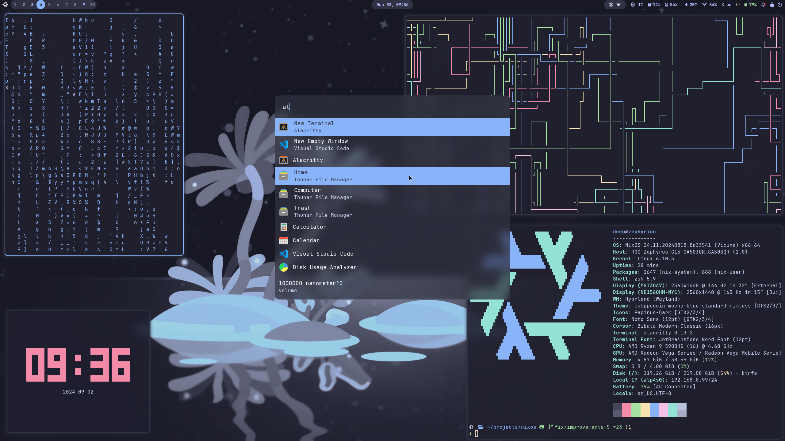

<h1 align="center">:snowflake: Nix Config :snowflake:</h1>

<p align="center">
  
</p>

<p align="center">
  <a href="https://github.com/deepanchal/nixos/stargazers"></a>
  <a href="https://nixos.org/"></a>
</p>
<p align="center">
  <a href="https://github.com/NixOS/nixpkgs/tree/nixos-unstable"></a>
</p>

> [!NOTE]
> I use this system as my daily driver. While it is stable enough for my needs, it is still a work in progress.

## Components

| Category    | Apps                                                                                                   |
| --------------------------- | :--------------------------------------------------------------------------------------------------------------------- |
| **Window Manager**          | [Hyprland][Hyprland] ![c++][cpp] &nbsp; / &nbsp; [Sway][Sway] ![c][c] &nbsp; / &nbsp; [SwayFx][SwayFx] ![c][c]         |
| **Display Manager**         | [greetd][greetd] ![rust][rs] &nbsp;+&nbsp; [tuigreet][tuigreet] ![rust][rs]                                            |
| **Terminal Emulator**       | [Alacritty][Alacritty] ![rust][rs]                                                                                     |
| **Shell**                   | [Zsh][Zsh] ![c][c] &nbsp;+&nbsp; [PowerLevel10K][PowerLevel10K] ![shell][sh]                                           |
| **Bar**                     | [Waybar][Waybar] ![c++][cpp]                                                                                           |
| **Application Launcher**    | [anyrun][anyrun] ![rust][rs]                                                                                           |
| **File Manager**            | [Yazi][Yazi] ![rust][rs] &nbsp;+&nbsp; [thunar][thunar] ![c][c]                                                        |
| **Filesystem**              | [Btrfs][Btrfs] ![c][c] &nbsp;+&nbsp; [disko][disko] ![nix][nix] &nbsp;&&nbsp; [impermanence][impermanence] ![nix][nix] |
| **Text Editor**             | [Neovim][Neovim] ![lua][lua] &nbsp;+&nbsp; [AstroNvim][AstroNvim] ![lua][lua]                                          |
| **Notification Daemon**     | [SwayNotificationCenter][SwayNotificationCenter] ![vala][va]                                                           |
| **Screenshot Software**     | [grim][grim] ![c][c] &nbsp;+&nbsp; [grimblast][grimblast] ![shell][sh] &nbsp; + &nbsp; [satty][satty] ![rust][rs]      |
| **Screen Recording**        | [OBS][OBS] ![c][c] &nbsp;+&nbsp; [wl-screenrec][wl-screenrec] ![rust][rs]                                              |
| **Fonts**                   | [JetBrainsMono Nerd fonts][Nerd fonts] ![css][css]                                                                     |
| **Image Viewer**            | [imv][imv] ![c][c]                                                                                                     |
| **Media Player**            | [mpv][mpv] ![c][c]                                                                                                     |
| **Music Player**            | [Spotify][Spotify] ![electron][electron]                                                                               |
| **Network management tool** | [NetworkManager][NetworkManager] ![c][c]                                                                               |
| **System resource monitor** | [Btop][Btop] ![c++][cpp]                                                                                               |

## Screenshots




## Theme

[Catppuccin Mocha][Catppuccin] theme with `blue` accent.

> [!TIP]
> See [`home/features/desktop/theme/catppuccin.nix`](home/features/desktop/theme/catppuccin.nix) file
> which defines base16 colors + other theme colors with nix-colors

| Color                   | Labels    | base16 | Hex       | RGB                  | HSL                  |
| ----------------------- | --------- | ------ | --------- | -------------------- | -------------------- |
| ![rosewater][rosewater] | rosewater | base06 | `#f5e0dc` | `rgb(245, 224, 220)` | `hsl(10, 56%, 91%)`  |
| ![flamingo][flamingo]   | flamingo  | base0F | `#f2cdcd` | `rgb(242, 205, 205)` | `hsl(0, 59%, 88%)`   |
| ![pink][pink]           | pink      |        | `#f5c2e7` | `rgb(245, 194, 231)` | `hsl(316, 72%, 86%)` |
| ![mauve][mauve]         | mauve     | base0E | `#cba6f7` | `rgb(203, 166, 247)` | `hsl(267, 84%, 81%)` |
| ![red][red]             | red       | base08 | `#f38ba8` | `rgb(243, 139, 168)` | `hsl(343, 81%, 75%)` |
| ![maroon][maroon]       | maroon    |        | `#eba0ac` | `rgb(235, 160, 172)` | `hsl(350, 65%, 77%)` |
| ![peach][peach]         | peach     | base09 | `#fab387` | `rgb(250, 179, 135)` | `hsl(23, 92%, 75%)`  |
| ![yellow][yellow]       | yellow    | base0A | `#f9e2af` | `rgb(249, 226, 175)` | `hsl(41, 86%, 83%)`  |
| ![green][green]         | green     | base0B | `#a6e3a1` | `rgb(166, 227, 161)` | `hsl(115, 54%, 76%)` |
| ![teal][teal]           | teal      | base0C | `#94e2d5` | `rgb(148, 226, 213)` | `hsl(170, 57%, 73%)` |
| ![sky][sky]             | sky       |        | `#89dceb` | `rgb(137, 220, 235)` | `hsl(189, 71%, 73%)` |
| ![sapphire][sapphire]   | sapphire  |        | `#74c7ec` | `rgb(116, 199, 236)` | `hsl(199, 76%, 69%)` |
| ![blue][blue]           | blue      | base0D | `#89b4fa` | `rgb(137, 180, 250)` | `hsl(217, 92%, 76%)` |
| ![lavender][lavender]   | lavender  | base07 | `#b4befe` | `rgb(180, 190, 254)` | `hsl(232, 97%, 85%)` |
| ![text][text]           | text      | base05 | `#cdd6f4` | `rgb(205, 214, 244)` | `hsl(226, 64%, 88%)` |
| ![subtext1][subtext1]   | subtext1  |        | `#bac2de` | `rgb(186, 194, 222)` | `hsl(227, 35%, 80%)` |
| ![subtext0][subtext0]   | subtext0  |        | `#a6adc8` | `rgb(166, 173, 200)` | `hsl(228, 24%, 72%)` |
| ![overlay2][overlay2]   | overlay2  |        | `#9399b2` | `rgb(147, 153, 178)` | `hsl(228, 17%, 64%)` |
| ![overlay1][overlay1]   | overlay1  |        | `#7f849c` | `rgb(127, 132, 156)` | `hsl(230, 13%, 55%)` |
| ![overlay0][overlay0]   | overlay0  |        | `#6c7086` | `rgb(108, 112, 134)` | `hsl(231, 11%, 47%)` |
| ![surface2][surface2]   | surface2  | base04 | `#585b70` | `rgb(88, 91, 112)`   | `hsl(233, 12%, 39%)` |
| ![surface1][surface1]   | surface1  | base03 | `#45475a` | `rgb(69, 71, 90)`    | `hsl(234, 13%, 31%)` |
| ![surface0][surface0]   | surface0  | base02 | `#313244` | `rgb(49, 50, 68)`    | `hsl(237, 16%, 23%)` |
| ![base][base]           | base      | base00 | `#1e1e2e` | `rgb(30, 30, 46)`    | `hsl(240, 21%, 15%)` |
| ![mantle][mantle]       | mantle    | base01 | `#181825` | `rgb(24, 24, 37)`    | `hsl(240, 21%, 12%)` |
| ![crust][crust]         | crust     |        | `#11111b` | `rgb(17, 17, 27)`    | `hsl(240, 23%, 9%)`  |

## Setup

> [!WARNING]  
> I have documented these setup instructions for myself and I may or may not have missed some setup steps.
> I would advise using parts of my config that are helpful for you instead of fully installing it :)

Run this command to setup nixos on your drive.

```bash
# Checkout repo
git clone https://github.com/deepanchal/nixos
# cd into dir
cd nixos
# Format your disk with disko
# Note: Replace `/dev/disk/by-id/ata-WDC_WDS240G2G0C-00AJM0_205130900427` with your drive to format it with disko and install nixos on the drive.
sudo nix --experimental-features "nix-command flakes" run github:nix-community/disko -- --mode disko ./hosts/zephyrion/disk-config.nix --arg device '"/dev/disk/by-id/ata-WDC_WDS240G2G0C-00AJM0_205130900427"'
# Make sure /mnt got formatted correctly with disko
# Install nixos
sudo nixos-install --root /mnt --no-root-password --show-trace --verbose --flake .#zephyrion
```

## References

### Awesome setups

List of awesome configs I used to build my config:

- https://github.com/vimjoyer/flake-starter-config
- https://github.com/sioodmy/dotfiles
- https://github.com/ryan4yin/nix-config
- https://github.com/NotAShelf/nyx
- https://github.com/Misterio77/nix-config
- https://github.com/Misterio77/nix-starter-configs
- https://github.com/XNM1/linux-nixos-hyprland-config-dotfiles
- https://github.com/fufexan/dotfiles

### Impermanence Resources

- https://grahamc.com/blog/erase-your-darlings/
- https://mt-caret.github.io/blog/posts/2020-06-29-optin-state.html
- https://elis.nu/blog/2020/06/nixos-tmpfs-as-home/
- https://github.com/talyz/presentations/blob/master/impermanence-nixcon-2023/impermanence.org
- https://github.com/vimjoyer/impermanent-setup/blob/main/final/disko.nix
- https://github.com/ryan4yin/nix-config/blob/783d61999cfbd31341f28d8531c544a77c570901/hosts/k8s/disko-config/README.md#2-partition-the-ssd--install-nixos-via-disko
- https://github.com/nix-community/impermanence

<!-- Links -->

<!-- Languages -->
<!-- https://github.com/inttter/md-badges -->

[rs]: https://img.shields.io/badge/-rust-orange
[nix]: https://img.shields.io/badge/-nix-5277C3
[sh]: https://img.shields.io/badge/-shell-green
[go]: https://img.shields.io/badge/-go-68D7E2
[cpp]: https://img.shields.io/badge/-c%2B%2B-red
[c]: https://img.shields.io/badge/-c-lightgrey
[z]: https://img.shields.io/badge/-zig-yellow
[va]: https://img.shields.io/badge/-vala-blueviolet
[da]: https://img.shields.io/badge/-dart-02D3B3
[py]: https://img.shields.io/badge/-python-blue
[lua]: https://img.shields.io/badge/-lua-%232C2D72
[css]: https://img.shields.io/badge/-css-1572B6
[ts]: https://img.shields.io/badge/-ts-007BCD
[js]: https://img.shields.io/badge/-js-F7DF1E
[nodejs]: https://img.shields.io/badge/-nodejs-6DA55F
[electron]: https://img.shields.io/badge/-electron-2B2E3A
[nim]: https://img.shields.io/badge/-nim-%23ffe953

<!-- ColorScheme -->

[rosewater]: https://img.shields.io/badge/rosewater-f5e0dc?style=for-the-badge&color=f5e0dc
[flamingo]: https://img.shields.io/badge/flamingo-f2cdcd?style=for-the-badge&color=f2cdcd
[pink]: https://img.shields.io/badge/pink-f5c2e7?style=for-the-badge&color=f5c2e7
[mauve]: https://img.shields.io/badge/mauve-cba6f7?style=for-the-badge&color=cba6f7
[red]: https://img.shields.io/badge/red-f38ba8?style=for-the-badge&color=f38ba8
[maroon]: https://img.shields.io/badge/maroon-eba0ac?style=for-the-badge&color=eba0ac
[peach]: https://img.shields.io/badge/peach-fab387?style=for-the-badge&color=fab387
[yellow]: https://img.shields.io/badge/yellow-f9e2af?style=for-the-badge&color=f9e2af
[green]: https://img.shields.io/badge/green-a6e3a1?style=for-the-badge&color=a6e3a1
[teal]: https://img.shields.io/badge/teal-94e2d5?style=for-the-badge&color=94e2d5
[sky]: https://img.shields.io/badge/sky-89dceb?style=for-the-badge&color=89dceb
[sapphire]: https://img.shields.io/badge/sapphire-74c7ec?style=for-the-badge&color=74c7ec
[blue]: https://img.shields.io/badge/blue-89b4fa?style=for-the-badge&color=89b4fa
[lavender]: https://img.shields.io/badge/lavender-b4befe?style=for-the-badge&color=b4befe
[text]: https://img.shields.io/badge/text-cdd6f4?style=for-the-badge&color=cdd6f4
[subtext1]: https://img.shields.io/badge/subtext1-bac2de?style=for-the-badge&color=bac2de
[subtext0]: https://img.shields.io/badge/subtext0-a6adc8?style=for-the-badge&color=a6adc8
[overlay2]: https://img.shields.io/badge/overlay2-9399b2?style=for-the-badge&color=9399b2
[overlay1]: https://img.shields.io/badge/overlay1-7f849c?style=for-the-badge&color=7f849c
[overlay0]: https://img.shields.io/badge/overlay0-6c7086?style=for-the-badge&color=6c7086
[surface2]: https://img.shields.io/badge/surface2-585b70?style=for-the-badge&color=585b70
[surface1]: https://img.shields.io/badge/surface1-45475a?style=for-the-badge&color=45475a
[surface0]: https://img.shields.io/badge/surface0-313244?style=for-the-badge&color=313244
[base]: https://img.shields.io/badge/base-1e1e2e?style=for-the-badge&color=1e1e2e
[mantle]: https://img.shields.io/badge/mantle-181825?style=for-the-badge&color=181825
[crust]: https://img.shields.io/badge/crust-11111b?style=for-the-badge&color=11111b

<!-- Apps / Components / Tools -->

[Hyprland]: https://github.com/hyprwm/Hyprland
[Sway]: https://github.com/swaywm/sway
[SwayFx]: https://github.com/WillPower3309/swayfx
[i3]: https://github.com/i3/i3
[Alacritty]: https://github.com/alacritty/alacritty
[Kitty]: https://github.com/kovidgoyal/kitty
[Nushell]: https://github.com/nushell/nushell
[Starship]: https://github.com/starship/starship
[Waybar]: https://github.com/Alexays/Waybar
[polybar]: https://github.com/polybar/polybar
[rofi]: https://github.com/davatorium/rofi
[anyrun]: https://github.com/Kirottu/anyrun
[Dunst]: https://github.com/dunst-project/dunst
[Fcitx5]: https://github.com/fcitx/fcitx5
[Btop]: https://github.com/aristocratos/btop
[mpv]: https://github.com/mpv-player/mpv
[Zellij]: https://github.com/zellij-org/zellij
[Neovim]: https://github.com/neovim/neovim
[AstroNvim]: https://github.com/AstroNvim/AstroNvim
[DoomEmacs]: https://github.com/doomemacs/doomemacs
[flameshot]: https://github.com/flameshot-org/flameshot
[grim]: https://github.com/emersion/grim
[grimblast]: https://github.com/hyprwm/contrib/tree/main/grimblast
[flameshot]: https://github.com/flameshot-org/flameshot
[imv]: https://sr.ht/~exec64/imv/
[OBS]: https://obsproject.com
[Mako]: https://github.com/emersion/mako
[Nerd fonts]: https://github.com/ryanoasis/nerd-fonts
[catppuccin]: https://github.com/catppuccin/catppuccin
[mpd]: https://github.com/MusicPlayerDaemon/MPD
[ncmpcpp]: https://github.com/ncmpcpp/ncmpcpp
[mpc]: https://github.com/MusicPlayerDaemon/mpc
[Netease-cloud-music-gtk]: https://github.com/gmg137/netease-cloud-music-gtk
[NetworkManager]: https://wiki.gnome.org/Projects/NetworkManager
[wl-clipboard]: https://github.com/bugaevc/wl-clipboard
[GDM]: https://wiki.archlinux.org/title/GDM
[thunar]: https://gitlab.xfce.org/xfce/thunar
[Yazi]: https://github.com/sxyazi/yazi
[Catppuccin]: https://github.com/catppuccin/catppuccin
[Btrfs]: https://btrfs.readthedocs.io
[LUKS]: https://wiki.archlinux.org/title/Dm-crypt/Encrypting_an_entire_system
[lanzaboote]: https://github.com/nix-community/lanzaboote
[SwayNotificationCenter]: https://github.com/ErikReider/SwayNotificationCenter
[greetd]: https://sr.ht/~kennylevinsen/greetd
[tuigreet]: https://github.com/apognu/tuigreet
[Zsh]: https://www.zsh.org/
[OhMyZsh]: https://github.com/ohmyzsh/ohmyzsh
[PowerLevel10K]: https://github.com/romkatv/powerlevel10k
[Spotify]: https://spotify.com
[wl-screenrec]: https://github.com/russelltg/wl-screenrec
[satty]: https://github.com/gabm/Satty
[disko]: https://github.com/nix-community/disko
[impermanence]: https://github.com/nix-community/impermanence
