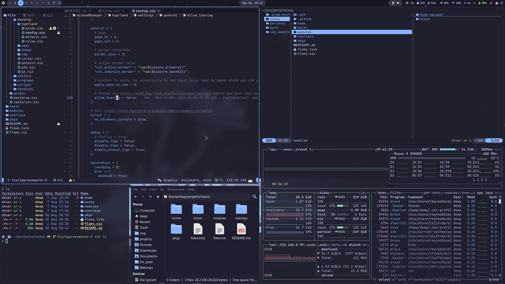

# NixOS Config

Work in progress nixos config.

## Screenshots





## Setup

Run this command to setup nixos on your drive. 

```bash
# Checkout repo
git clone https://github.com/deepanchal/nixos
# cd into dir
cd nixos
# Format your disk with disko
# Note: Replace `/dev/disk/by-id/ata-WDC_WDS240G2G0C-00AJM0_205130900427` with your drive to format it with disko and install nixos on the drive.
sudo nix --experimental-features "nix-command flakes" run github:nix-community/disko -- --mode disko ./hosts/zephyrion/disk-config.nix --arg device '"/dev/disk/by-id/ata-WDC_WDS240G2G0C-00AJM0_205130900427"'
# Make sure /mnt got formatted correctly with disko
# Install nixos
sudo nixos-install --root /mnt --no-root-password --show-trace --verbose --flake .#zephyrion
```

## References

### Awesome setups

List of awesome configs I used to build my config:

- https://github.com/vimjoyer/flake-starter-config
- https://github.com/sioodmy/dotfiles
- https://github.com/ryan4yin/nix-config
- https://github.com/NotAShelf/nyx
- https://github.com/Misterio77/nix-config
- https://github.com/Misterio77/nix-starter-configs
- https://github.com/XNM1/linux-nixos-hyprland-config-dotfiles
- https://github.com/fufexan/dotfiles

### Awesome Impermanence Resources

- https://grahamc.com/blog/erase-your-darlings/
- https://mt-caret.github.io/blog/posts/2020-06-29-optin-state.html
- https://elis.nu/blog/2020/06/nixos-tmpfs-as-home/
- https://github.com/talyz/presentations/blob/master/impermanence-nixcon-2023/impermanence.org
- https://github.com/vimjoyer/impermanent-setup/blob/main/final/disko.nix
- https://github.com/ryan4yin/nix-config/blob/783d61999cfbd31341f28d8531c544a77c570901/hosts/k8s/disko-config/README.md#2-partition-the-ssd--install-nixos-via-disko
- https://github.com/nix-community/impermanence
